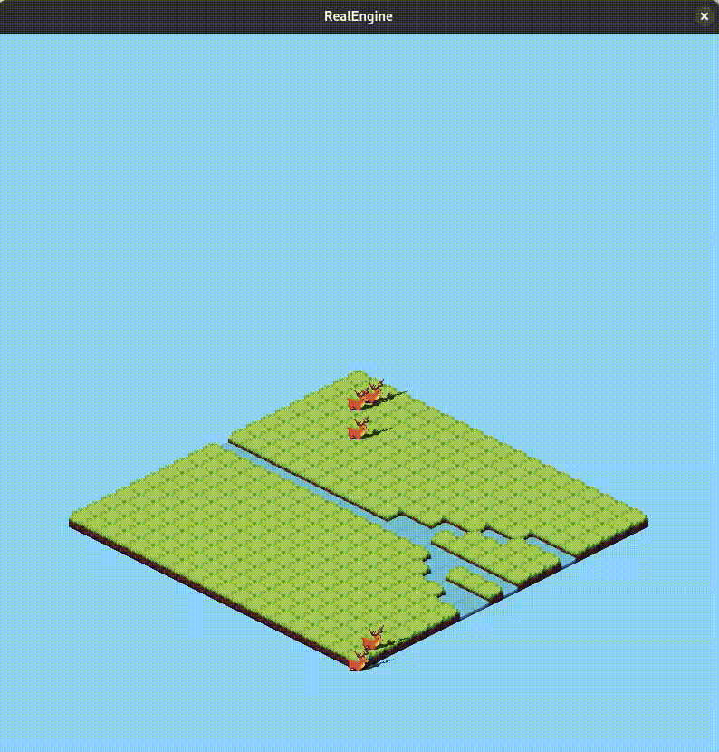

# RealEngine

RealEngine is a simple, educational 2D game engine written in C, utilizing the SDL3 library for cross-platform graphics and input handling.

## Features

*   **2D Isometric Rendering:** RealEngine specializes in creating isometric worlds, providing a classic perspective for your games.
*   **Entity Component System (ECS) architecture:** The engine is built upon an ECS-like architecture, allowing for flexible and data-oriented design of game entities and their behaviors.
*   **Asset Management:** Easily load and manage game assets, such as images and sprites, with a straightforward asset management system.
*   **Configuration-driven Scenes:** Define your game worlds and entities through simple configuration files, allowing for quick iteration and design changes without recompiling.
*   **Player and NPC Logic:** The engine includes basic implementations for player-controlled characters and non-player characters (NPCs) with simple AI behaviors like random movement and following the player.
*   **Layered Rendering:** Render your game scenes with multiple layers to create depth and control the drawing order of game objects.

## Dependencies

*   **SDL3:** RealEngine relies on the Simple DirectMedia Layer (SDL) version 3 for windowing, graphics, and input.
*   **CMake:** A cross-platform build system is required to generate project files and build the engine.
*   **Unity** Unit testing framework built for C, with a focus on working with embedded toolchains
*   **Log** A simple logging library implemented in C99

## Installation

1.  **Clone the repository:**

    ```bash
    git clone --recurse-submodules -j8 https://github.com/qrutyy/RealEngine.git
    cd RealEngine
    ```

2.  **Build the project:**

    ```bash
    cmake -S . -B build
    cmake --build build
    ```

## Usage

To run the demo application, execute the following command from the project's root directory:

```bash
./build/RealEngine
```

### Creating a Scene

Game scenes in RealEngine are defined in `.cfg` files. These files specify the map layout, assets, and entities. Config is represented in a small DSL format. Description of the `.cfg` files structures are presented in `guide.cfg`

**Example `demo.cfg`:**

```ini
[Assets]
asset.1.shortcut=g
asset.1.name=Grass
asset.1.filename=assets/tiles/grass.png
asset.1.pos=0,64
asset.1.dim=128,64

[Map]
grid.dim=20,20
tile.dim=128,64

[Entities]
entity.1.shortcut=p
entity.1.type=PLAYER
entity.1.asset=3

[Map.Layout.Layer.0]
gggggggggggggggggggg
gggggggggggggggggggg
...

[Map.Layout.Layer.1]
--------------------
---------p----------
--------------------
...
```

### Engine API

RealEngine provides a simple C API for initializing the engine, loading assets, creating entities, and running the main game loop.
WIP


## Contributing

Please read our [CONTRIBUTING.md](https://github.com/qrutyy/RealEngine/blob/main/CONTRIBUTING.md) file before submitting any pull requests. It contains important information about:

- How to submit pull requests (PRs)  
- What types of contributions are allowed  
- Permissions and licensing for contributed code  

By following the guidelines in `CONTRIBUTING.md`, you help us maintain code quality and ensure all contributions comply with the project license.

## License

This code is published under GNU GPL V3 license described in [LICENSE](https://github.com/qrutyy/RealEngine/blob/main/LICENSE.md)

## Game Example

